# WEEK 3

## No.1

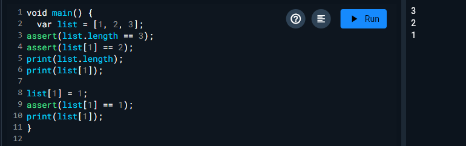

Kode ini mendefinisikan sebuah array `list` dengan nilai `[1, 2, 3]` dan memeriksa apakah panjang array dan nilai elemen pada indeks tertentu sesuai dengan yang diharapkan menggunakan `assert`. Awalnya, panjang array diverifikasi sebagai 3, dan elemen kedua (`list[1]`) diverifikasi bernilai 2. Setelah itu, elemen kedua diubah menjadi 1 dan kembali diperiksa dengan `assert`. Pada akhirnya, kode mencetak panjang array, nilai elemen kedua sebelum dan sesudah diubah, menghasilkan output 3, 2, dan 1 secara berurutan.

- Ubah kode pada langkah 1 menjadi variabel final yang mempunyai index = 5 dengan default value = null. Isilah nama dan NIM Anda pada elemen index ke-1 dan ke-2. 

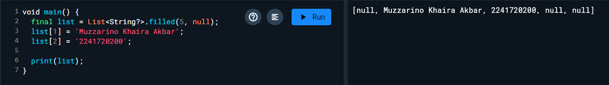

## No.2

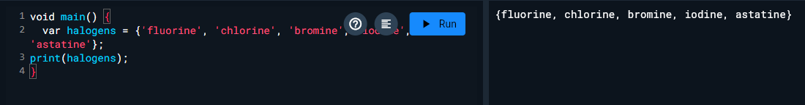

- Tambahkan elemen nama dan NIM Anda pada kedua variabel Set tersebut dengan dua fungsi berbeda yaitu .add() dan .addAll().

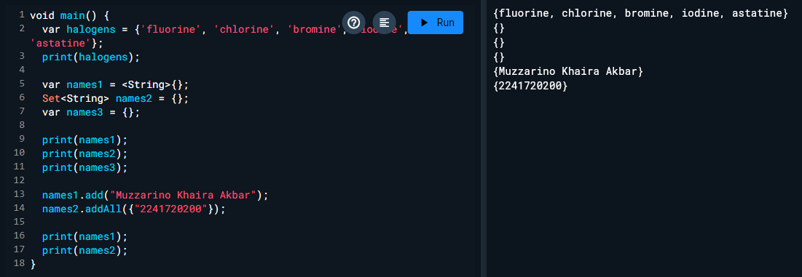

## No.3

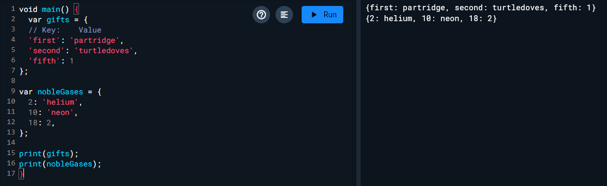

Kode ini mendefinisikan dua buah *map* (dictionary) dalam bahasa pemrograman Dart, yaitu `gifts` dan `nobleGases`, yang masing-masing berisi pasangan *key-value*. Map `gifts` menggunakan *key* berupa string untuk menunjukkan hadiah (contohnya `'first'` dengan nilai `'partridge'`), sedangkan map `nobleGases` menggunakan *key* berupa angka untuk mewakili nomor atom dan gas mulia (contohnya 2 untuk `'helium'`). Elemen-elemen dari kedua map ini kemudian dicetak menggunakan fungsi `print()`, yang akan menampilkan semua *key-value* yang ada dalam map tersebut.

- Tambahkan elemen nama dan NIM Anda pada tiap variabel di atas (gifts, nobleGases, mhs1, dan mhs2). Dokumentasikan hasilnya dan buat laporannya!

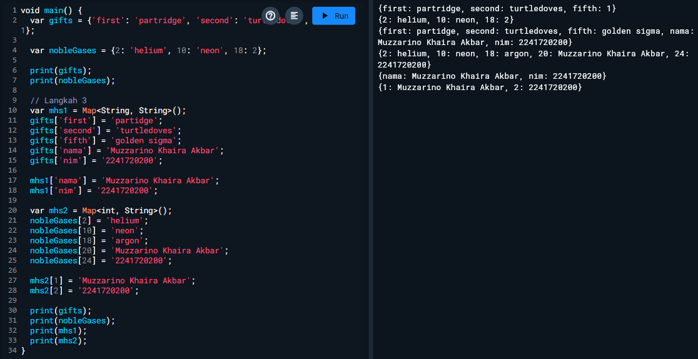

## No.4

var list = [1, 2, 3];
var list2 = [0, ...list];
print(list1);
print(list2);
print(list2.length);

Error karena seharusnya inisiasi print(list) karena tidak ada list1 sehingga tidak bisa di inisiasi

ini yang benar
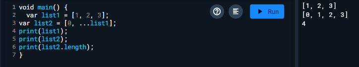

- Tambahkan variabel list berisi NIM Anda menggunakan Spread Operators. Dokumentasikan hasilnya dan buat laporannya!

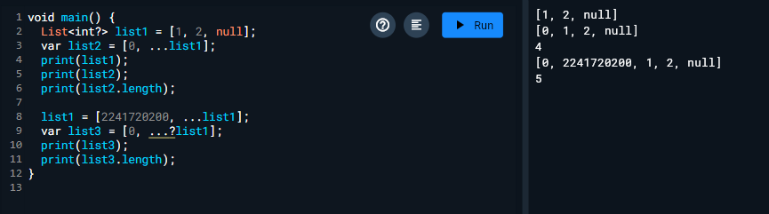

var nav = ['Home', 'Furniture', 'Plants', if (promoActive) 'Outlet'];
print(nav);
- Tunjukkan hasilnya jika variabel promoActive ketika true dan false.

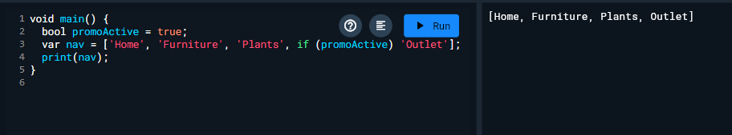
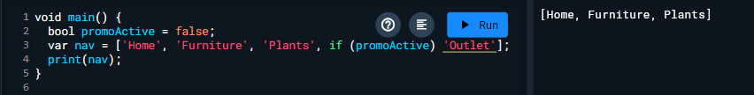

Login belum terdefinisi
Jadi seperti ini

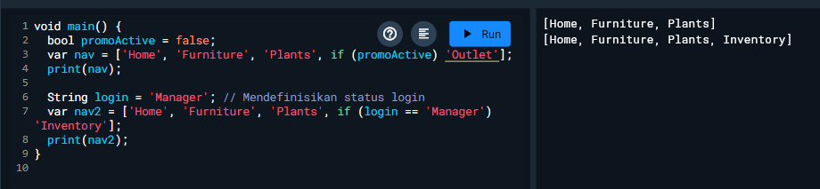

## No.5 
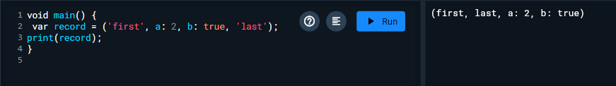

kita melakukan inisialisasi variable record dengan mendeklarasikan record yaitu ('first', a: 2, b: true, 'last'). Pada record kita bisa memberikan sebuah key: value dan string biasa.

- Tambahkan kode program berikut di dalam scope void main(), lalu coba eksekusi (Run) kode Anda.

// Record type annotation in a variable declaration:
(String, int) mahasiswa;
print(mahasiswa);

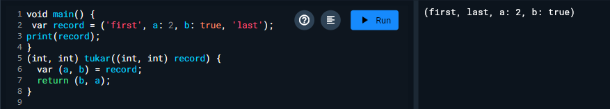

Inialisasi NIM dan nama

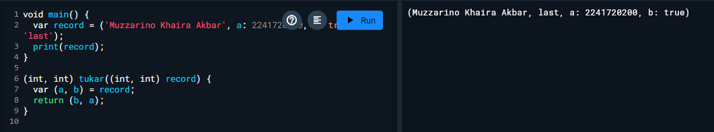

- Tambahkan kode program berikut di dalam scope void main(), lalu coba eksekusi (Run) kode Anda.

var mahasiswa2 = ('first', a: 2, b: true, 'last');

print(mahasiswa2.$1); // Prints 'first'
print(mahasiswa2.a); // Prints 2
print(mahasiswa2.b); // Prints true
print(mahasiswa2.$2); // Prints 'last'

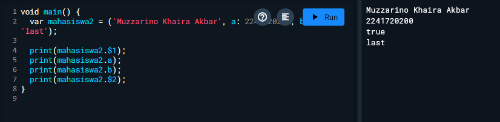

Kita mendefinisikan tuple mahasiswa2 dengan nama "Muzzarino Khaira Akbar" sebagai elemen pertama, 2241720200 sebagai parameter bernama a, true sebagai parameter bernama b, dan 'last' sebagai elemen terakhir.

## TUGAS

### 1. Functions dalam Bahasa Dart

Functions dalam Dart adalah sekumpulan kode yang dirancang untuk menjalankan tugas tertentu. Penggunaan fungsi membantu kita dalam menyusun kode dengan lebih teratur, meningkatkan keterbacaan, dan memungkinkan kita untuk menggunakan kembali kode yang sama di berbagai bagian program. Fungsi dapat menerima masukan dalam bentuk parameter, melakukan serangkaian operasi, dan mengembalikan hasil atau nilai sebagai output.

### 2. Jenis parameter dalam fungsi Dart
- Positional parameters

void greet(String name) {

  print('Hello, $name!');
}

- Optional Positional Parameters

void greet(String name, [String? title]) {

  print('Hello, $title $name!');
}

- Named parameters

void greet({required String name, String? title}) {

  print('Hello, $title $name!');
}

### 3. Functions sebagai First-Class Objects
Fungsi dianggap sebagai first-class objects, yang berarti mereka dapat diperlakukan seperti nilai. Ini termasuk kemampuan untuk seperti menyimpan fungsi dalam variabel, mengirim fungsi sebagai argumen ke fungsi lain, dan mengembalikan fungsi dari fungsi.

- void Function() createGreeting(String name) {

  return () => print('Hello, $name!');
}

void main() {

  var greet = createGreeting('Muzzarino');

  greet(); // Output: Hello, Muzzarino!

}

### 4. Anonymous Functions
Anonymous functions (fungsi anonim) adalah fungsi tanpa nama yang dapat didefinisikan dan digunakan langsung. 

- void main() { 

  var numbers = [1, 2, 3];

  var doubled = numbers.map((number) => number * 2);

  print(doubled.toList()); // Output: [2, 4, 6]

}

### 5. Perbedaan Lexical Scope dan Lexical Closures
`'Lexical Scope'` adalah konsep yang berkaitan dengan kemampuan suatu fungsi untuk mengakses variabel berdasarkan lokasi di mana fungsi tersebut didefinisikan. Ini berarti bahwa fungsi hanya dapat mengakses variabel yang berada dalam ruang lingkup (scope) di sekitarnya saat fungsi itu dibuat.

- void main() {

  var outerVar = 'Hello';
  
  void innerFunction() {

    print(outerVar); // Akses ke outerVar

  }
  
  innerFunction(); // Output: Hello

}

`'Lexical Closures'` adalah fungsi yang dapat mengingat variabel-variabel yang ada dalam ruang lingkupnya, bahkan ketika fungsi tersebut dipanggil di luar ruang lingkup tersebut. Dengan kata lain, fungsi ini 'mengikat' variabel yang ada, sehingga tetap bisa diakses meskipun konteks aslinya sudah tidak aktif lagi.

- Function createCounter() {

  int count = 0;
  
  return () {

    count++;

    return count;

  };

}

void main() {

  var counter = createCounter();

  print(counter()); // Output: 1

  print(counter()); // Output: 2

}

### 6. Cara Membuat Return Multiple Value di Functions

Dart tidak memiliki sintaks khusus untuk mengembalikan beberapa nilai secara langsung, tetapi kita bisa menggunakan List, Map, atau objek untuk mencapainya. Salah satu cara yang umum adalah menggunakan tuple.

- List<int> calculate(int a, int b) {

  return [a + b, a * b]; // Mengembalikan jumlah dan hasil kali

}

void main() {

  var results = calculate(3, 4);

  print('Sum: ${results[0]}, Product: ${results[1]}'); // Output: Sum: 7, Product: 12

}

