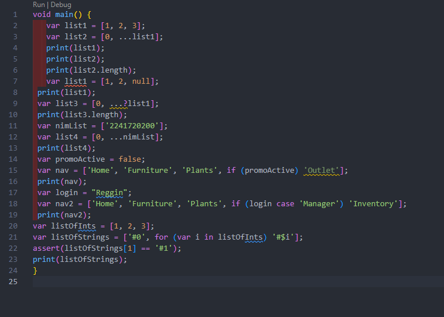
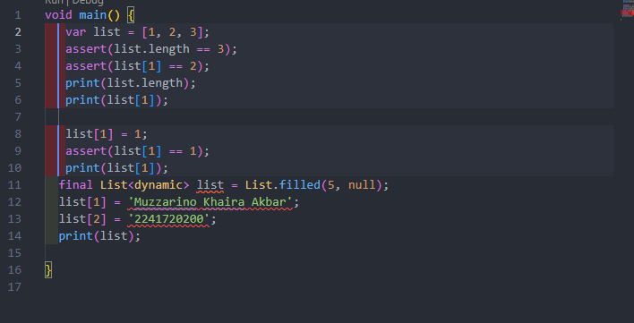
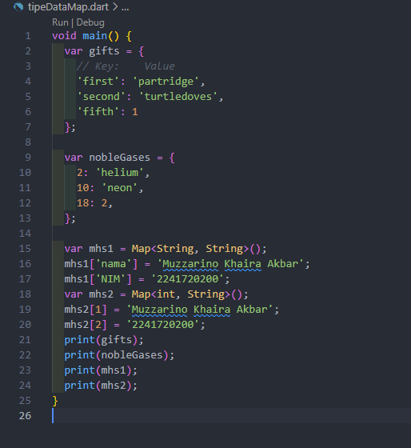
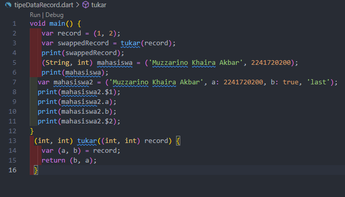
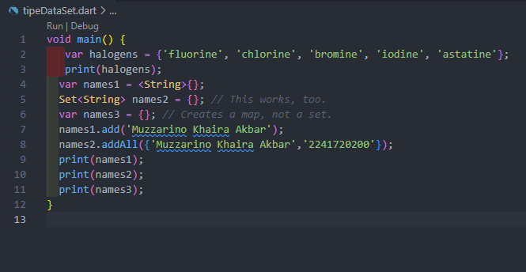
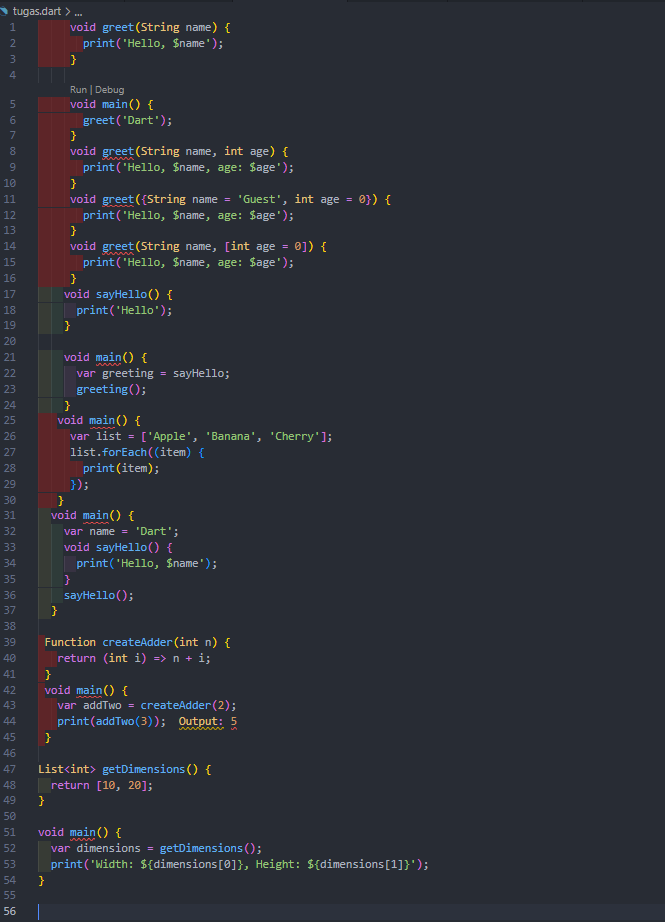

# Week 4

1. 

di atas adalah contoh penggunaan fitur "spread operator" dan "collection if" dalam bahasa pemrograman Dart untuk memanipulasi daftar (list). Awalnya, kode mendemonstrasikan cara menggabungkan atau menyalin elemen dari satu daftar ke daftar lain menggunakan spread operator (...) serta bagaimana mengatasi nilai null dengan operator ...?. Dalam contoh lain, kode menggunakan "collection if" untuk menambahkan elemen ke daftar berdasarkan kondisi tertentu. Contohnya, jika variabel promoActive bernilai false, elemen 'Outlet' tidak akan dimasukkan ke dalam daftar nav. Hal serupa dilakukan dengan login, yang memanfaatkan pattern matching (fitur case) untuk menambahkan elemen hanya jika login sesuai dengan pola 'Manager'. Pada bagian akhir, kode membuat daftar string (listOfStrings) berdasarkan daftar angka (listOfInts), menggunakan "for loop" di dalam list comprehension untuk menghasilkan string seperti #0, #1, dan seterusnya. Hasil akhirnya adalah daftar string yang dicetak, dan menggunakan pernyataan assert untuk memastikan elemen kedua dari daftar adalah '#1'.

2. 

Pada kode di atas, fungsi main() digunakan untuk mendeklarasikan sebuah list (daftar) dengan ukuran tetap, yaitu 5 elemen. List ini didefinisikan menggunakan final dan diinisialisasi dengan fungsi List.filled(5, null), yang berarti setiap elemen awalnya berisi nilai null.

List ini bersifat dinamis (List<dynamic>), yang berarti elemen-elemennya dapat diisi dengan berbagai tipe data. Dalam kode ini, elemen pada indeks 1 diisi dengan string 'Muzzarino Khaira Akbar', dan elemen pada indeks 2 diisi dengan string '2241720200'. Setelah itu, list dicetak menggunakan print(list), yang akan menampilkan seluruh isi list, termasuk nilai null pada elemen lainnya yang tidak diubah. Hasil akhirnya adalah list yang berisi dua elemen dengan nilai yang telah diisi dan tiga elemen lainnya tetap bernilai null.

3. 

Pada kode di atas, terdapat tiga jenis map (peta) yang dideklarasikan dan diinisialisasi untuk menyimpan pasangan key-value (kunci-nilai). Map ini memungkinkan Anda untuk mengasosiasikan nilai dengan sebuah kunci tertentu. Berikut adalah penjelasannya dalam bentuk paragraf:

Map pertama adalah gifts, yang menyimpan pasangan kunci dan nilai dalam bentuk string, kecuali pada kunci 'fifth' yang memiliki nilai berupa angka (1). Kunci berupa string seperti 'first', 'second', dan 'fifth' digunakan untuk mengakses nilai terkait, seperti 'partridge', 'turtledoves', dan 1.

Map kedua adalah nobleGases, yang menggunakan angka sebagai kunci, seperti 2, 10, dan 18. Nilai yang terkait dengan kunci-kunci ini beragam, misalnya angka 2 dikaitkan dengan string 'helium', dan angka 18 dikaitkan dengan angka 2.

Selanjutnya, dua map lainnya yaitu mhs1 dan mhs2 digunakan untuk menyimpan informasi mahasiswa. mhs1 menggunakan kunci dan nilai yang keduanya berupa string. Di sini, 'nama' digunakan sebagai kunci untuk menyimpan 'Muzzarino Khaira Akbar', dan 'NIM' untuk menyimpan '2241720200'. Sedangkan mhs2 menggunakan angka sebagai kunci, seperti 1 dan 2, di mana kunci-kunci ini berhubungan dengan nilai yang merupakan string, yaitu 'Muzzarino Khaira Akbar' dan '2241720200'.

4. 

 di atas menunjukkan penggunaan fitur record di Dart, yang diperkenalkan untuk mempermudah pengelolaan grup nilai tanpa harus mendefinisikan tipe data khusus (seperti class). Berikut adalah penjelasan kode dalam paragraf:

Fungsi main() ini mendemonstrasikan penggunaan record yang bisa menyimpan beberapa nilai dengan berbagai tipe data. Pertama, sebuah record mahasiswa2 dideklarasikan dengan beberapa elemen: 'Muzzarino Khaira Akbar' sebagai nilai pertama, sebuah elemen bernama a dengan nilai 2241720200, elemen b bernilai true, dan sebuah nilai terakhir 'last'. Record ini dapat menyimpan berbagai tipe data dalam satu variabel.

Untuk mengakses elemen dari record tersebut, kode menggunakan sintaks khusus. Elemen pertama diakses dengan mahasiswa2.$1, di mana tanda $ diikuti nomor urut elemen. Elemen yang dinamai (a dan b) dapat diakses langsung dengan nama tersebut, seperti mahasiswa2.a dan mahasiswa2.b. Elemen kedua yang tidak diberi nama, diakses dengan mahasiswa2.$2.

dan tukar berfungsi untuk menukar dua nilai integer yang ada dalam record.

5. 

di atas, terdapat beberapa contoh penggunaan Set di Dart, yang merupakan struktur data serupa dengan list, tetapi setiap elemen dalam set harus unik (tidak ada duplikasi). Berikut adalah penjelasan kode dalam bentuk paragraf:

Pertama, sebuah set bernama halogens dideklarasikan menggunakan {} dan diisi dengan elemen-elemen seperti 'fluorine', 'chlorine', 'bromine', 'iodine', dan 'astatine'. Set ini dicetak menggunakan print(), yang akan menampilkan semua elemen dalam set tersebut.

Selanjutnya, variabel names1 dideklarasikan sebagai set kosong dengan tipe data String, sedangkan names2 dideklarasikan menggunakan sintaks yang sama, tetapi dengan pendeklarasian tipe eksplisit Set<String>. Kedua variabel ini benar-benar set kosong. Kemudian ada names3, yang menggunakan {} tanpa tipe, tetapi ini justru menciptakan sebuah map (peta), bukan set. Ini terjadi karena dalam Dart, deklarasi {} tanpa tipe diasumsikan sebagai map, bukan set.

## TUGAS

1. Jelaskan yang dimaksud Functions dalam bahasa Dart!
2. Jelaskan jenis-jenis parameter di Functions beserta contoh sintaksnya!
3. Jelaskan maksud Functions sebagai first-class objects beserta contoh sintaknya!
4. Apa itu Anonymous Functions? Jelaskan dan berikan contohnya!
5. Jelaskan perbedaan Lexical scope dan Lexical closures! Berikan contohnya!
6. Jelaskan dengan contoh cara membuat return multiple value di Functions

 Fungsi dalam Dart adalah blok kode yang dapat dipanggil untuk melakukan tugas tertentu. Fungsi dapat menerima input (parameter), memproses data, dan mengembalikan output. Fungsi membantu dalam mengorganisir kode, menghindari pengulangan, dan meningkatkan keterbacaan.

 - Dart memungkinkan kita untuk mendefinisikan beberapa fungsi dengan nama yang sama, tetapi dengan parameter yang berbeda, yang dikenal sebagai overloading. Contoh di bawah menunjukkan bagaimana kita dapat membuat beberapa fungsi greet dengan parameter yang berbeda:
  

void greet(String name) {
  print('Hello, $name');
}

void greet(String name, int age) {
  print('Hello, $name, age: $age');
}

void greet({String name = 'Guest', int age = 0}) {
  print('Hello, $name, age: $age');
}

void greet(String name, [int age = 0]) {
  print('Hello, $name, age: $age');
}

void main() {
  greet('Dart');               // Menggunakan greet(String name)
  greet('Dart', 5);           // Menggunakan greet(String name, int age)
  greet(name: 'Alice');        // Menggunakan greet({String name})
  greet('Bob', 30);            // Menggunakan greet(String name, [int age])
}

- Dart memperlakukan fungsi sebagai first-class objects. Anda dapat menyimpan fungsi dalam variabel dan memanggilnya melalui variabel tersebut:
 
void sayHello() {
  print('Hello');
}

void main() {
  var greeting = sayHello; // Menyimpan fungsi sayHello dalam variabel greeting
  greeting();              // Memanggil fungsi melalui variabel
}

- Anonymous functions adalah fungsi tanpa nama yang sering digunakan sebagai argumen untuk fungsi lain. Contoh berikut menunjukkan penggunaan anonymous function dengan forEach:
 
void main() {
  var list = ['Apple', 'Banana', 'Cherry'];
  list.forEach((item) {      // Menggunakan anonymous function
    print(item);             // Mencetak setiap item dalam list
  });
}

- Lexical scope mengacu pada cara variabel diakses berdasarkan lokasi mereka didefinisikan. Dalam contoh ini, sayHello() dapat mengakses variabel name dari lingkup yang lebih luar:
 
void main() {
  var name = 'Dart';
  void sayHello() {
    print('Hello, $name'); // Mengakses variabel name dari lingkup luar
  }
  sayHello(); // Memanggil sayHello
}

- Fungsi di Dart dapat mengembalikan beberapa nilai menggunakan list. Berikut adalah contohnya:
 

List<int> getDimensions() {
  return [10, 20]; // Mengembalikan list berisi dua nilai
}

void main() {
  var dimensions = getDimensions();
  print('Width: ${dimensions[0]}, Height: ${dimensions[1]}'); // Mengakses nilai yang dikembalikan
}

- Fungsi dapat mengembalikan fungsi lain. Contoh di bawah menunjukkan cara membuat fungsi yang mengembalikan fungsi lain untuk menambah nilai:
 
Function createAdder(int n) {
  return (int i) => n + i; // Mengembalikan fungsi penambah
}

void main() {
  var addTwo = createAdder(2); // Mengambil fungsi yang menambah 2
  print(addTwo(3)); // Output: 5
}

